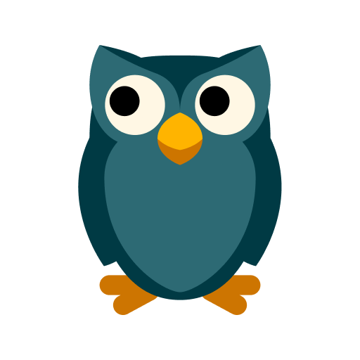

  

# HungryOwl

**Your personal guide to symptom-free eating!**

Prevent food-related symptoms with HungryOwl — a privacy-first mobile app that helps you identify potential trigger ingredients before you eat.

   
   

## ✨ Features

**🔍 SEE CLEARLY**  
Instantly spot symptom triggers hiding in your meals with intelligent ingredient analysis.

**⚡ SAVE TIME**  
No more tedious ingredient checks — get personalized insights in seconds by simply snapping a photo.

**🛡️ STAY AHEAD**  
Prevent symptoms before they start by knowing what ingredients to avoid based on your personal symptom profile.

## How It Works

1. **Add your personal symptoms** - Tell HungryOwl what food-related symptoms you experience
2. **Snap a photo** - Take a picture of any food item or ingredient list
3. **Get personalized analysis** - Receive instant insights on how each ingredient may affect you
4. **Eat with confidence** - Make informed decisions about your food choices

## 🔒 Privacy First

**YOUR DATA, YOUR PRIVACY:**  
HungryOwl runs entirely on your device. We never collect, store, or sell your data, so your information stays completely private and secure!

## 📱 Platform Support

- ✅ iOS
- ✅ Android

## 💬 Contributions

HungryOwl is not accepting any contributions. If you find a bug and would like to create an issue, please feel free to do so.

## 📄 License

This project is open source. Please see the LICENSE file for details.

---

**Made with ❤️ for people who want to eat without worry**
